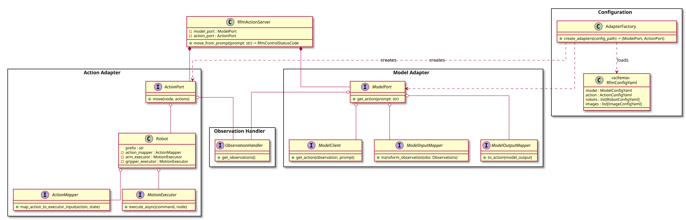

# RFM Control Architecture

The architecture follows a **configuration-driven, layered design** based on **Hexagonal Architecture** (Ports and Adapters pattern) that separates concerns and enables flexibility through YAML-based configuration.

## Key Features

✅ **Configuration-Driven**: Change robot setup, model type, or control strategy by editing YAML files  
✅ **Type-Safe**: Pydantic validates configuration at load time  
✅ **Extensible**: Add new models, action types, or robots without modifying core logic  
✅ **Decoupled**: Clear separation between model inference, action execution, and observation  
✅ **Multi-Robot Support**: Configurable for single-arm, dual-arm, or heterogeneous robot setups  

## Hexagonal Architecture

This system implements the **Hexagonal Architecture** pattern, which provides clear separation between:

- **Core Domain Logic** (Center): `RfmActionServer` orchestrates the control flow
- **Ports** (Interfaces): `ModelPort` and `ActionPort` define abstract contracts
- **Adapters** (Implementations): Concrete implementations for different models and robots
  - Model Adapters: `Gr00tAdapter`, `OctoAdapter` (connect to AI models)
  - Action Adapters: `FollowJointTrajectoryAdapter` (connect to robot controllers)
- **External Systems**: AI model servers (GR00T, Octo), ROS2 robot controllers, cameras

**Benefits of Hexagonal Architecture:**
- **Technology Independence**: Core logic doesn't depend on external frameworks
- **Testability**: Easy to swap real implementations with mocks (e.g., `Gr00tClientMock`)
- **Flexibility**: Add new models or robots by implementing new adapters
- **Clear Boundaries**: Ports define explicit contracts between layers

## Architecture Layers

### 1. Configuration Layer
- **RfmConfigYaml**: Pydantic-based schema that defines the complete system configuration (model, action, robots, images)
- **AdapterFactory**: Creates runtime components (ModelPort, ActionPort) from YAML configuration files

### 2. Orchestration Layer
- **RfmActionServer**: Entry point that coordinates ModelPort and ActionPort to execute robot actions from natural language prompts

### 3. Adapter Layers
- **Model Adapter (ModelPort)**: Handles AI model inference
  - ModelClient: Communicates with AI models (GR00T, Octo)
  - ModelInputMapper: Transforms observations into model-specific input format
  - ModelOutputMapper: Parses model output into intermediate actions
  
- **Action Adapter (ActionPort)**: Executes robot actions
  - Robot: Orchestrates action mapping and execution per robot instance
  - ActionMapper: Converts intermediate actions into executor-specific commands
  - MotionExecutor: Executes commands on physical/simulated robots

### 4. Observation Handler
- **ObservationHandler**: Generic observation collection (images, joint states)

## Architecture Diagram



## Execution Flow

1. **Configuration Loading**: `AdapterFactory` loads and validates a YAML configuration file (e.g., `gr00t_so101.yaml`)
2. **Component Creation**: `AdapterFactory` creates `ModelPort` and `ActionPort` instances based on the configuration
3. **Server Initialization**: `RfmActionServer` is initialized with the created ModelPort and ActionPort
4. **Prompt Received**: User sends a natural language prompt to `RfmActionServer`
5. **Observation Collection**: `ObservationHandler` gathers current robot state (joint positions, camera images)
6. **Model Input Preparation**: `ModelInputMapper` transforms observations into model-specific format
7. **Model Inference**: `ModelClient` sends prepared input to AI model and receives output
8. **Model Output Parsing**: `ModelOutputMapper` converts model output into intermediate actions
9. **Action Mapping**: `ActionMapper` (within `Robot`) transforms actions into executor-specific commands
10. **Action Execution**: `MotionExecutor` executes commands on the robot (arm and gripper)
11. **Iteration**: Steps 5-10 repeat for multiple inference cycles


## Example Usage

```python
from rfm_control.factories.adapter_factory import AdapterFactory
from rfm_control.rfm_action_server import RfmActionServer

# Load configuration and create adapters
factory = AdapterFactory()
model_port, action_port = factory.create_adapters("config/gr00t_so101.yaml")

# Initialize and run server
server = RfmActionServer(model_port, action_port)
server.move_from_prompt("pick up the cup")
```

## Configuration

The system is configured via YAML files that define:
- **Model settings**: AI model type (GR00T, Octo), client type (real/mock), mapper type
- **Action settings**: Action adapter type, action mapper type
- **Robot configurations**: Controller topics, joint mappings, MoveIt planning groups
- **Camera configurations**: Camera topics, resolutions, image types, transformations

### Quick Configuration

Choose a template that matches your setup:

| Template | Description |
|----------|-------------|
| [`gr00t_mock.yaml`](config/configs/gr00t_mock.yaml) | Single arm, GR00T model, mock client for testing |
| [`gr00t_so101_rtc.yaml`](config/configs/gr00t_so101_rtc.yaml) | Single arm, GR00T model, real-time control |
| [`gr00t_so101_dual.yaml`](config/configs/gr00t_so101_dual.yaml) | Dual arm, GR00T model |
| [`octo_ur5_mock.yaml`](config/configs/octo_ur5_mock.yaml) | Single arm, Octo model, mock client |

### Creating Custom Configurations

**Step 1**: Copy a template
```bash
cd config/configs/
cp gr00t_mock.yaml my_robot_config.yaml
```

**Step 2**: Update robot and camera settings
```yaml
model:
  type: gr00t
  client_type: mock

action:
  type: follow_joint_trajectory
  arm_action_mapper: absolute_joint # map policy output actions to absolut joint states

robots:
  - prefix: ""
    group_name: "arm"
    joint_state_topic: "/joint_states"
    arm:
      topic_name: "/arm_controller/follow_joint_trajectory"
      model_input_position_key: "state.joint_positions"
      model_output_position_key: "action.joint_positions"
    gripper:
      # ... gripper configuration

images:
  - model_input_key: "video.wrist"
    topic_name: "/camera/image_raw/compressed"
    resolution: [640, 480]
```

**Step 3**: Validate configuration
```bash
python -m rfm_control.config.validate_yaml my_robot_config.yaml
```

### 📘 Complete Configuration Guide

For a comprehensive step-by-step guide including:
- Prerequisites and information gathering
- Detailed configuration for model, action, robots, and cameras
- Real-world examples (UR5 robot setup)
- Common patterns (dual-arm, multiple cameras, testing vs production)
- Troubleshooting tips

**See the complete guide**: [`config/README.md`](config/README.md#-complete-guide-configuring-for-your-robot)

### 🔧 Extending the System

The configuration system is designed to be easily extensible. You can add:
- **New AI models** (e.g., RT-1, OpenVLA) by implementing ModelClient, ModelInputMapper, and ModelOutputMapper
- **New action mappers** (e.g., Cartesian control) for different control strategies
- **Custom image transformations** for model-specific preprocessing

All extensions follow the Hexagonal Architecture pattern and the registry-based factory system, ensuring:
- No changes to core logic required
- Type-safe configuration through `config_types.py` and Pydantic
- Easy testing with mock implementations

**See the extension guide**: [`config/README.md`](config/README.md#-extending-the-configuration-system)
